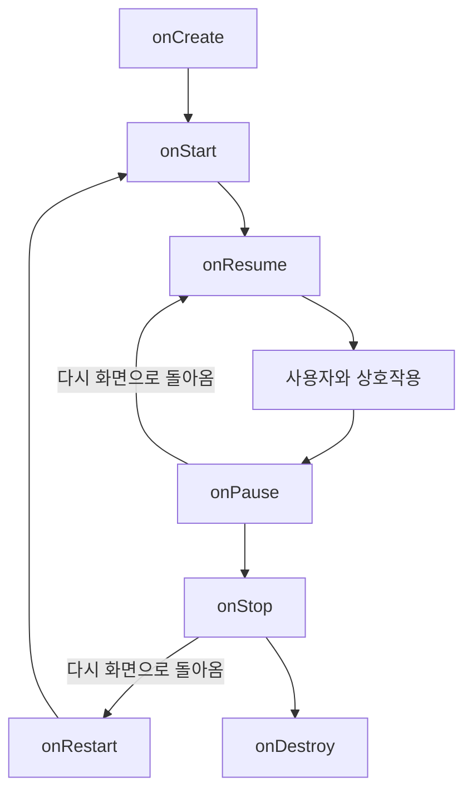
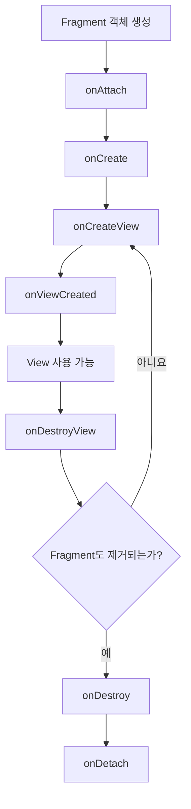
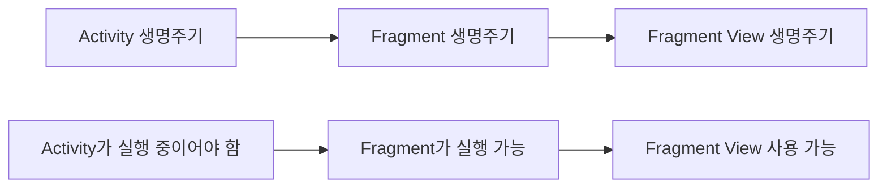

# Activity와 Fragment의 생명주기는 어떻게 다르며 왜 구분해야 하나요?

## 한 문장 답변

> **Activity는 앱의 한 화면 전체를 관리하는 생명주기를 가지며, Fragment는 Activity 안에 포함되어 자신의 생명주기와 화면 View의 생명주기를 별도로 가진다. 특히 Fragment 객체와 Fragment의 View가 서로 다른 시점에 제거될 수 있으므로 두 생명주기를 구분해야 메모리 누수와 잘못된 UI 접근을 방지할 수 있다.**

## 개념과 동작 원리

## 쉬운 비유로 이해하기

Activity와 Fragment의 관계는 **건물과 방**으로 생각하면 쉽다.

```text
Activity = 건물 한 채
Fragment = 건물 안에 있는 방
Fragment의 View = 방 안에 배치된 가구
```

예를 들어 하나의 쇼핑몰 건물이 있다고 가정해보자.

```text
MainActivity라는 쇼핑몰
 ├─ 홈 화면 Fragment
 ├─ 검색 화면 Fragment
 └─ 마이페이지 Fragment
```

Activity는 쇼핑몰 건물 전체를 관리한다.

Fragment는 쇼핑몰 안에 있는 각각의 매장이나 공간과 비슷하다. 사용자가 하단 메뉴를 누르면 홈 매장에서 검색 매장으로 이동하는 것처럼 Fragment 화면이 교체된다.

### Activity가 사라지는 경우

Activity가 종료되는 것은 건물 자체가 철거되는 것과 비슷하다.

```text
건물 철거
→ 건물 안의 방도 사라짐
→ 방 안의 가구도 사라짐
```

Activity가 `onDestroy()`되면 그 안에 들어 있던 Fragment와 View도 영향을 받는다.

화면 회전도 기본적으로는 기존 건물을 잠시 철거하고 새로운 방향에 맞는 건물을 다시 짓는 것과 비슷하다.

```text
세로 화면 Activity 제거
        ↓
가로 화면 Activity 새로 생성
```

그래서 Activity의 일반 변수에 저장했던 값은 화면 회전 후 사라질 수 있다.

```kotlin
private var count = 10
```

화면을 회전하면 새로운 Activity 객체가 만들어지므로 `count`가 다시 초기값으로 돌아갈 수 있다.

이를 막기 위해 ViewModel이라는 별도의 창고에 데이터를 보관한다.

```text
Activity = 건물
ViewModel = 건물이 다시 지어져도 유지되는 외부 창고
```

건물이 회전 때문에 다시 지어져도 창고에 저장한 데이터는 그대로 가져올 수 있다.

---

### Fragment와 View가 따로 존재하는 이유

Fragment에서는 **방 자체와 방 안의 가구를 따로 생각해야 한다.**

```text
Fragment 객체 = 방의 정보와 관리 담당자
Fragment View = 방 안에 실제로 보이는 가구
```

어떤 Fragment가 뒤로가기 목록인 백 스택에 들어가면 방에 대한 정보는 남겨두면서, 화면에 보이던 가구만 치울 수 있다.

```text
Fragment 객체: 남아 있음
Fragment View: 제거됨
```

쉽게 말하면 다음과 같다.

> 방은 나중에 다시 사용할 예정이라 기록에는 남겨두지만, 현재 사용하지 않으므로 책상과 의자 같은 가구는 창고로 치워둔 상태이다.

사용자가 다시 해당 Fragment로 돌아오면 가구를 다시 배치한다.

```text
화면 진입
→ onCreateView()
→ View 생성

화면에서 나감
→ onDestroyView()
→ View 제거

다시 돌아옴
→ onCreateView()
→ View 다시 생성
```

이것이 Activity와 Fragment의 가장 중요한 차이이다.

Activity는 화면 전체 객체의 생명주기를 주로 관리하지만, Fragment는 다음 두 가지를 따로 관리해야 한다.

```text
1. Fragment 객체의 생명주기
2. Fragment View의 생명주기
```

---

### View Binding을 정리해야 하는 이유

View Binding은 방 안의 가구 위치를 기록한 목록이라고 생각할 수 있다.

```text
binding.textView
→ 방 안의 TextView를 가리킴

binding.button
→ 방 안의 Button을 가리킴
```

그런데 방 안의 가구를 모두 치웠는데도 가구 목록을 계속 들고 있다면 문제가 생긴다.

```text
Fragment
  ↓
Binding
  ↓
이미 제거된 View
```

화면에서는 사라졌지만 Fragment가 Binding을 통해 이전 View를 계속 참조하므로 메모리에서 View가 제거되지 않을 수 있다.

이는 이사를 끝냈는데도 이전 집의 가구를 계속 보관하며 공간을 차지하는 것과 비슷하다.

따라서 Fragment의 View가 제거될 때 Binding도 함께 비워야 한다.

```kotlin
override fun onDestroyView() {
    super.onDestroyView()
    _binding = null
}
```

```text
onDestroyView()
→ 방 안의 가구 제거
→ 가구 목록인 Binding도 제거
```

이 작업을 하지 않으면 사용하지 않는 View가 메모리에 계속 남는 메모리 누수가 발생할 수 있다.

---

### `viewLifecycleOwner`를 사용하는 이유

Fragment에서 데이터를 관찰할 때는 Fragment 객체가 아니라 Fragment의 View를 기준으로 관찰하는 것이 안전하다.

이를 카페 직원과 전광판으로 비유할 수 있다.

```text
Fragment 객체 = 카페 직원
Fragment View = 카페 전광판
데이터 = 전광판에 표시할 주문 정보
```

카페 직원은 남아 있지만 전광판이 철거된 상태일 수 있다.

이때 직원이 계속 전광판에 주문 정보를 표시하려 하면 문제가 발생한다.

```text
직원은 존재함
전광판은 제거됨
그런데 전광판에 글자를 출력하려고 함
```

이것이 Fragment의 생명주기만 기준으로 데이터를 관찰할 때 발생할 수 있는 문제이다.

```kotlin
lifecycleScope.launch {
    viewModel.uiState.collect { state ->
        binding.textView.text = state.message
    }
}
```

Fragment 객체가 살아 있으므로 데이터 수집은 계속되지만, View가 이미 제거되었다면 `binding.textView`를 안전하게 사용할 수 없다.

그래서 전광판이 설치되어 있는 동안에만 데이터를 관찰하도록 `viewLifecycleOwner`를 사용한다.

```kotlin
viewLifecycleOwner.lifecycleScope.launch {
    viewLifecycleOwner.repeatOnLifecycle(Lifecycle.State.STARTED) {
        viewModel.uiState.collect { state ->
            binding.textView.text = state.message
        }
    }
}
```

```text
View 생성
→ 데이터 관찰 시작

View 제거
→ 데이터 관찰 중단
```

즉, `viewLifecycleOwner`는 다음과 같은 역할을 한다.

> 화면이 실제로 존재할 때만 UI를 업데이트하고, 화면이 제거되면 UI 업데이트를 멈추게 한다.

---

### 비유로 한 번에 정리

```text
Activity
= 건물 전체

Fragment
= 건물 안의 방

Fragment View
= 방 안의 가구

ViewModel
= 건물을 다시 지어도 유지되는 외부 창고

View Binding
= 가구 위치를 기록한 목록

onDestroyView()
= 방 안의 가구를 치우는 시점

_binding = null
= 더 이상 존재하지 않는 가구 목록을 버리는 것

viewLifecycleOwner
= 가구가 실제로 배치되어 있을 때만 사용하는 관리 기준
```

핵심은 다음 한 문장으로 기억하면 된다.

> **Activity는 건물 전체의 수명을 관리하고, Fragment는 방의 수명뿐 아니라 방 안에 있는 가구인 View의 수명까지 따로 관리해야 한다.**

---

### Activity의 생명주기

Activity는 앱에서 하나의 화면 또는 창을 담당한다.

대표적인 생명주기 콜백은 다음과 같다.

```text
onCreate()
   ↓
onStart()
   ↓
onResume()
   ↓
사용자가 화면을 사용함
   ↓
onPause()
   ↓
onStop()
   ↓
onDestroy()
```

각 콜백의 역할은 다음과 같다.

| 콜백            | 의미                     | 주로 하는 작업                     |
| ------------- | ---------------------- | ---------------------------- |
| `onCreate()`  | Activity가 처음 생성됨       | 레이아웃 설정, ViewModel 연결, 초기 설정 |
| `onStart()`   | 화면이 사용자에게 보이기 시작함      | 화면 표시와 관련된 작업 시작             |
| `onResume()`  | 사용자가 화면과 상호작용할 수 있음    | 카메라, 센서, 애니메이션 등 활성화         |
| `onPause()`   | 다른 화면이 일부 가리거나 포커스를 잃음 | 일시 중지해야 하는 작업 처리             |
| `onStop()`    | 화면이 완전히 보이지 않음         | 위치 업데이트, 리소스 사용 중지           |
| `onDestroy()` | Activity가 제거됨          | 남은 리소스 정리                    |

Activity는 화면 회전이나 언어·테마·화면 크기 변경 같은 구성 변경이 발생하면 기본적으로 기존 인스턴스가 파괴되고 새로운 인스턴스로 다시 생성된다.



---

### Fragment의 생명주기

Fragment는 Activity 안에 들어가는 독립적인 화면 조각이다.

예를 들어 하나의 Activity 안에서 다음과 같은 Fragment를 교체할 수 있다.

```text
MainActivity
 ├─ HomeFragment
 ├─ SearchFragment
 └─ MyPageFragment
```

Fragment에는 Activity와 비슷한 생명주기 외에도 Activity에는 없는 콜백이 존재한다.

```text
onAttach()
   ↓
onCreate()
   ↓
onCreateView()
   ↓
onViewCreated()
   ↓
onStart()
   ↓
onResume()
   ↓
onPause()
   ↓
onStop()
   ↓
onDestroyView()
   ↓
onDestroy()
   ↓
onDetach()
```

| 콜백                | 의미                      | 주로 하는 작업                        |
| ----------------- | ----------------------- | ------------------------------- |
| `onAttach()`      | Fragment가 Activity에 연결됨 | Context가 필요한 초기 작업              |
| `onCreate()`      | Fragment 객체가 생성됨        | View와 관계없는 초기 설정                |
| `onCreateView()`  | Fragment의 화면 View를 생성함  | View Binding 생성, 레이아웃 반환        |
| `onViewCreated()` | View 생성이 완료됨            | 클릭 리스너, RecyclerView, 데이터 관찰 설정 |
| `onDestroyView()` | Fragment의 View가 제거됨     | Binding, Adapter, View 참조 해제    |
| `onDestroy()`     | Fragment 객체가 제거됨        | Fragment 자체 리소스 정리              |
| `onDetach()`      | Activity와의 연결이 해제됨      | Context 연결 종료                   |

Fragment의 핵심은 **Fragment 객체의 생명주기와 Fragment가 보여주는 View의 생명주기가 분리되어 있다는 점**이다. Fragment의 View는 `onCreateView()`에서 만들어지고 `onDestroyView()`에서 제거된다.



즉, 다음과 같은 상태가 가능하다.

```text
Fragment 객체: 살아 있음
Fragment의 View: 이미 제거됨
```

예를 들어 Fragment가 백 스택에 들어가면 Fragment 객체는 남아 있지만 화면 View만 먼저 제거될 수 있다. 이후 사용자가 뒤로 돌아오면 해당 Fragment의 View가 다시 생성될 수 있다.

---

### Activity와 Fragment 생명주기의 관계

Fragment는 Activity 안에서 동작하므로 Fragment의 생명주기는 Activity의 상태에 영향을 받는다.

Activity가 `STOPPED` 상태인데 그 안의 Fragment만 `RESUMED` 상태가 될 수는 없다. Fragment는 자신을 포함하는 Activity보다 더 활성화된 상태로 올라갈 수 없다.



정리하면 다음과 같다.

```text
Activity
 └─ Fragment 객체
     └─ Fragment View
```

바깥쪽 생명주기가 종료되면 그 안에 포함된 생명주기도 영향을 받는다.

## Android 또는 실제 개발에서의 적용

### 화면이 회전하게 되면

화면 회전은 `orientation`이라는 구성 변경을 발생시킨다.

기본적으로 다음 과정이 실행된다.

```text
기존 Activity
onPause()
→ onStop()
→ onDestroy()

새 Activity
onCreate()
→ onStart()
→ onResume()
```

Activity가 재생성되기 때문에 Activity 안의 일반 멤버 변수도 초기화된다.

```kotlin
class MainActivity : AppCompatActivity() {

    private var count = 0

    override fun onCreate(savedInstanceState: Bundle?) {
        super.onCreate(savedInstanceState)
    }
}
```

예를 들어 `count`가 10인 상태에서 화면을 회전하면 새로운 Activity 객체가 생성되면서 다시 0이 될 수 있다. 구성 변경 시 기존 Activity와 그 안의 객체에 저장된 상태는 새로운 Activity 인스턴스에 자동으로 전달되지 않는다.

이러한 데이터를 유지하려면 보통 `ViewModel`을 사용한다.

```kotlin
class CounterViewModel : ViewModel() {
    var count = 0
}
```

```kotlin
class MainActivity : AppCompatActivity() {

    private val viewModel: CounterViewModel by viewModels()

    override fun onCreate(savedInstanceState: Bundle?) {
        super.onCreate(savedInstanceState)

        viewModel.count++
    }
}
```

`ViewModel`은 Activity나 Fragment가 구성 변경으로 다시 생성되더라도 데이터를 유지할 수 있다. 따라서 화면 회전 때마다 서버 데이터를 다시 요청하는 문제를 줄일 수 있다. 다만 앱 프로세스 자체가 종료되면 일반 ViewModel의 데이터도 사라질 수 있으므로, 필요한 상태는 `SavedStateHandle`이나 데이터베이스 등에 저장해야 한다.

---

### Fragment에서 메모리 누수가 발생하는 대표적인 경우

Fragment에서 View Binding을 다음과 같이 사용할 수 있다.

```kotlin
class HomeFragment : Fragment(R.layout.fragment_home) {

    private var _binding: FragmentHomeBinding? = null

    private val binding
        get() = _binding!!

    override fun onViewCreated(
        view: View,
        savedInstanceState: Bundle?
    ) {
        super.onViewCreated(view, savedInstanceState)

        _binding = FragmentHomeBinding.bind(view)

        binding.button.setOnClickListener {
            binding.textView.text = "버튼 클릭"
        }
    }

    override fun onDestroyView() {
        super.onDestroyView()
        _binding = null
    }
}
```

`_binding = null` 처리가 필요한 이유는 Fragment 객체가 Fragment의 View보다 오래 살아 있을 수 있기 때문이다.

```text
Fragment 객체 ──────────────────────── 생존
Fragment View ─────── 제거됨
Binding       ─────── View를 참조 중
```

`onDestroyView()` 이후에도 Binding을 유지하면 제거된 View 전체가 메모리에 남을 수 있다.

```text
Fragment
  ↓
Binding
  ↓
Root View
  ↓
TextView, RecyclerView, ImageView 등
```

따라서 `onDestroyView()`에서 Binding 참조를 제거해야 한다. Android 공식 문서도 Fragment가 View보다 오래 유지될 수 있으므로 `onDestroyView()`에서 Binding 참조를 정리하도록 안내한다.

---

### Fragment에서 데이터를 관찰할 때

Fragment에서는 Fragment 자체의 생명주기보다 **Fragment View의 생명주기**를 기준으로 UI 데이터를 관찰하는 것이 안전하다.

```kotlin
override fun onViewCreated(
    view: View,
    savedInstanceState: Bundle?
) {
    super.onViewCreated(view, savedInstanceState)

    viewLifecycleOwner.lifecycleScope.launch {
        viewLifecycleOwner.repeatOnLifecycle(Lifecycle.State.STARTED) {
            viewModel.uiState.collect { state ->
                binding.textView.text = state.message
            }
        }
    }
}
```

다음처럼 Fragment 자체의 `lifecycleScope`를 사용하면 주의해야 한다.

```kotlin
lifecycleScope.launch {
    viewModel.uiState.collect { state ->
        binding.textView.text = state.message
    }
}
```

Fragment 객체는 살아 있지만 View가 파괴된 상태에서도 데이터 수집이 계속될 수 있기 때문이다. 이때 이미 제거된 Binding이나 View를 접근하면 예외나 메모리 누수로 이어질 수 있다.

```text
Fragment lifecycle: STARTED 또는 CREATED
Fragment View lifecycle: DESTROYED
```

따라서 View를 변경하는 작업은 가능하면 `viewLifecycleOwner`에 연결한다.

## 장단점과 트레이드오프

### Activity 중심 구조

장점은 구조가 단순하다는 것이다.

작은 앱이나 화면 수가 적은 앱에서는 여러 Activity를 사용하면 각 화면이 독립적이어서 이해하기 쉽다.

반면 화면마다 Activity를 생성하면 화면 전환, 상태 공유, 공통 UI 관리가 복잡해질 수 있다.

```text
LoginActivity
MainActivity
DetailActivity
SettingActivity
```

최근 Android 앱에서는 하나의 Activity 안에서 여러 Fragment 또는 Compose 화면을 전환하는 Single Activity 구조를 많이 사용한다. Android 공식 문서 역시 현대적인 앱에서 Single Activity 구조가 일반적으로 사용된다고 설명한다.

---

### Fragment 중심 구조

장점은 하나의 Activity 안에서 화면 일부를 유연하게 교체할 수 있다는 것이다.

```text
MainActivity
 ├─ HomeFragment
 ├─ SearchFragment
 └─ ProfileFragment
```

Navigation Component, BottomNavigationView, ViewPager2와 함께 사용하기 좋고 태블릿이나 폴더블처럼 넓은 화면에서도 여러 Fragment를 동시에 표시할 수 있다.

단점은 다음 세 가지 생명주기를 함께 이해해야 한다는 것이다.

```text
1. Activity 생명주기
2. Fragment 객체 생명주기
3. Fragment View 생명주기
```

이를 구분하지 않으면 다음 문제가 발생할 수 있다.

* `onDestroyView()` 이후 Binding 접근
* 화면을 다시 열 때 Observer가 중복 등록됨
* RecyclerView Adapter가 이전 View를 계속 참조함
* Context 또는 Activity 참조가 해제되지 않음
* 화면 회전 후 데이터가 중복 요청됨
* 이미 사라진 화면에 비동기 작업 결과를 반영함

따라서 Fragment가 항상 Activity보다 가벼운 것은 아니다. 화면을 재사용하고 Navigation을 구성하기에는 유리하지만 생명주기 관리 비용은 더 크다.

## 이어질 수 있는 질문

* 예상 질문: Fragment의 `onCreate()`와 `onViewCreated()`는 어떻게 다른가요?

* 짧은 답변: `onCreate()`는 Fragment 객체가 생성된 시점이고, `onViewCreated()`는 Fragment가 보여줄 View 생성까지 완료된 시점이다. View 클릭 이벤트나 RecyclerView 설정은 보통 `onViewCreated()`에서 처리한다.

* 예상 질문: `onDestroyView()`와 `onDestroy()`는 어떻게 다른가요?

* 짧은 답변: `onDestroyView()`는 Fragment의 화면만 제거된 것이고, `onDestroy()`는 Fragment 객체 자체가 제거된 것이다.

* 예상 질문: Fragment에서 왜 `viewLifecycleOwner`를 사용하나요?

* 짧은 답변: Fragment 객체보다 View의 수명이 짧기 때문에, View가 제거되면 데이터 관찰도 함께 중단되도록 하기 위해 사용한다.

* 예상 질문: 화면 회전 때 데이터를 다시 요청하지 않으려면 어떻게 하나요?

* 짧은 답변: 데이터를 ViewModel에 저장하고 Activity나 Fragment는 ViewModel의 상태를 관찰하도록 만든다.

* 예상 질문: ViewModel은 앱이 종료돼도 데이터를 보존하나요?

* 짧은 답변: 화면 회전 같은 구성 변경에는 데이터를 유지하지만 프로세스가 종료되면 사라질 수 있다. 중요한 데이터는 `SavedStateHandle`, Room, DataStore, 서버 등에 저장해야 한다.

## 핵심 정리

```text
Activity
- 앱의 화면 또는 창 전체를 관리한다.
- 화면 회전 시 기본적으로 파괴되고 재생성된다.
- onCreate → onStart → onResume 순서로 활성화된다.

Fragment
- Activity 안의 화면 일부를 관리한다.
- Fragment 객체 생명주기와 View 생명주기가 따로 존재한다.
- View는 onCreateView에서 생성되고 onDestroyView에서 제거된다.
- onDestroyView에서 Binding과 View 참조를 정리해야 한다.

구분해야 하는 이유
- Fragment 객체는 살아 있지만 View는 제거된 상태가 존재한다.
- View 생명주기를 무시하면 메모리 누수와 잘못된 UI 접근이 발생한다.
- 화면 회전이나 화면 전환 때 데이터 중복 요청과 상태 손실을 막을 수 있다.
```

## 참고 자료

* [Android Developers - Activity 생명주기](https://developer.android.com/guide/components/activities/activity-lifecycle)
* [Android Developers - Fragment 생명주기](https://developer.android.com/guide/fragments/lifecycle?hl=ko)
* [Android Developers - 구성 변경 처리](https://developer.android.com/topic/architecture/views/resources/runtime-changes-views?hl=ko)
* [Android Developers - View Binding](https://developer.android.com/topic/libraries/view-binding?hl=ko)
* [Android Developers - ViewModel 개요](https://developer.android.com/topic/libraries/architecture/views/viewmodel?hl=ko)
* [Android Developers - UI 상태 저장](https://developer.android.com/topic/libraries/architecture/saving-states?hl=ko)
